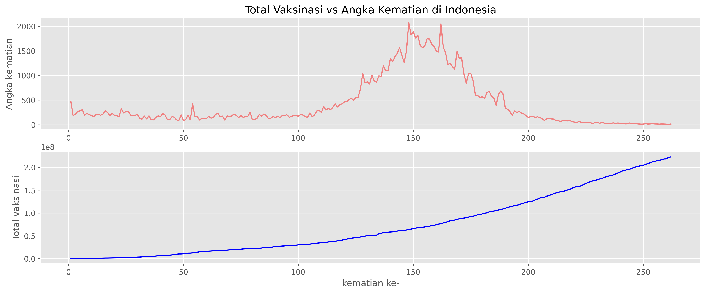

# Covid-Vaccination-vs-Death-Ratio

## 📌 Tentang Proyek
Proyek ini bertujuan untuk menganalisis hubungan antara tingkat vaksinasi COVID-19 dan angka kematian akibat virus ini. Analisis dilakukan menggunakan data dari berbagai negara yang terdampak pandemi. Dengan teknik analisis data, proyek ini berupaya mengidentifikasi pola dan _insight_ penting yang dapat menjadi bahan pertimbangan dalam perumusan kebijakan penanggulangan COVID-19.

## 📂 Data Source  
- Dataset yang digunakan dalam analisis ini diperoleh dari [Kaggle](https://www.kaggle.com/datasets/tohidkhanbagani/covid-19-deaths-and-vaccinations-dataset?select=COVID_VACCINATIONS.csv).  
- Data ini telah melalui tahap preprocessing untuk menghilangkan missing values dan menggabungkan beberapa kolom agar sesuai dengan kebutuhan analisis.

## 🔧 Teknologi yang Digunakan
- Python
- Pandas
- Matplotlib / Seaborn

## 📈 Analisis yang Dilakukan
1. **Eksplorasi Data** → Memeriksa missing values, distribusi data, dan ringkasan statistik.  
2. **Korelasi Vaksinasi & Kematian** → Melihat bagaimana tingkat vaksinasi mempengaruhi angka kematian.  
3. **Visualisasi Data** → Menggunakan grafik untuk memahami tren COVID-19 di berbagai negara.  

## 📊 Hasil Visualisasi


## 🚀 Cara Menjalankan
1. Clone repositori ini:
   ```sh
   git clone https://github.com/Izmahikmah/covid-vaccination-vs-death-ratio.git
2. Instal dependencies:
   pip install pandas matplotlib seaborn
3. Jalankan Script analisis:
   python analysis.py

 ## 📢 Kesimpulan
1. Tingkat vaksinasi yang lebih tinggi cenderung berhubungan dengan angka kematian yang lebih rendah.
2. Masih perlu mempertimbangkan faktor lain seperti kebijakan kesehatan dan varian virus.
